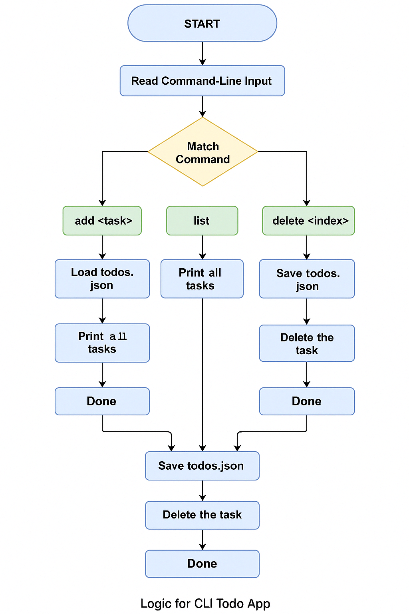

# godo - A CLI Todo App in Go

`godo` is a command-line todo list manager written in Go. It helps you stay organized by allowing you to add, view, complete, and delete tasks right from your terminal. Tasks are saved in a local JSON file, so your list persists even after you quit.

---

## Features

- Add tasks with a single command
- List all tasks with status indicators
- Mark tasks as done
- Delete completed or unwanted tasks
- All tasks are stored in a local `todos.json` file

---

## How It Works

Each time you run `godo`, it:

1. Reads your command (like `add`, `list`, `done`, or `delete`)
2. Loads the task list from `todos.json`
3. Applies your action
4. Saves the updated list

---

## Flowchart

This visual explains the logic of the app:



---

## Folder Structure

```
/godo
├── main.go             # Entry point, command parsing
├── logic.go            # Core task logic (Add, List, Done, Delete)
├── logic_test.go       # Unit tests and benchmarks
├── todos.json          # Data file (auto-created)
├── go.mod              # Go module
├── README.md           # Project documentation
├── flowchart.png       # Visual flowchart of app logic
├── cpu.prof            # (optional) CPU profile output
├── mem.prof            # (optional) Memory profile output
```

---

## Testing & Benchmarking

To run unit tests with:

```bash
go test
```

To run benchmarks:

```bash
go test -bench=.
```

For memory & CPU profiling, integrate `pprof` in `main.go` and generate:

```bash
go run main.go
go tool pprof cpu.prof
```

---

## Example Usage

```bash
go run main.go add "Finish Go project"
go run main.go list
go run main.go done 1
go run main.go delete 2
```

---

## Built With

- Go (Golang)
- Standard libraries only (`os`, `fmt`, `encoding/json`, etc.)
- Inspired by minimalism and the UNIX philosophy

---

## License

This project is open-source and free to use for learning and personal use.